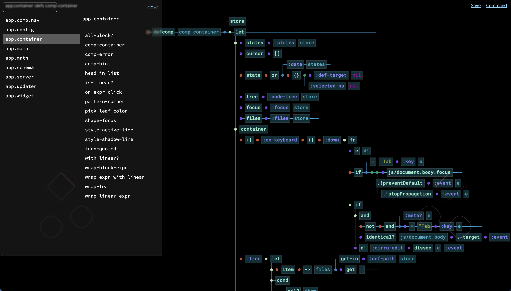

## (Experimental) Hovenia Editor

> Canvas-based tree layout for Calcit `compact.cirru`.

- Explainations for demo https://www.bilibili.com/video/BV1z3411J76p
- Demos https://www.bilibili.com/video/BV1tq4y1a7bB https://www.bilibili.com/video/BV16a411i7aq



### Usage

Launch CLI for an HTTP server, at same folder of `compact.cirru`:

```bash
# install deps for Calcit into `.config/calcit/modules/`...

cr --entry server path/to/hovernia-editor/compact.cirru
```

Use Web UI from http://repo.cirru.org/hovenia-editor/ .

### Workflow

Workflow https://github.com/Phlox-GL/phlox-workflow

### License

MIT
