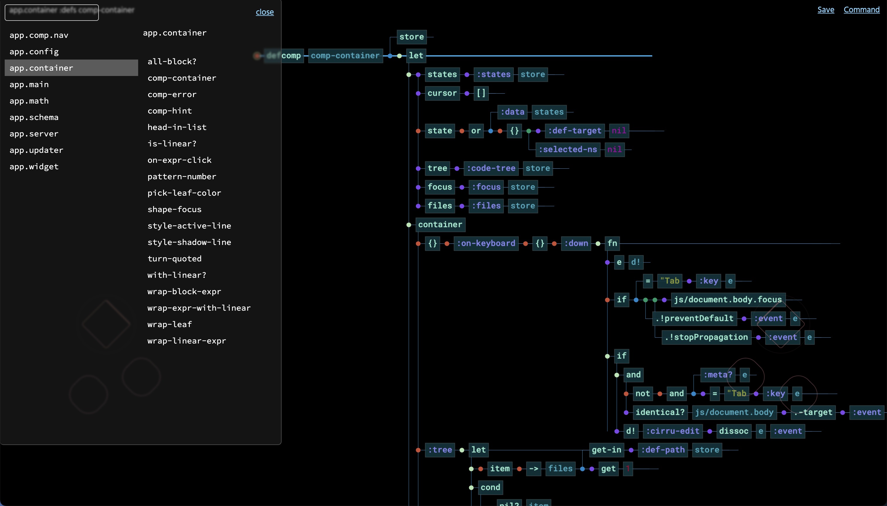

## (Experimental) Hovenia Editor

> Canvas-based tree layout for Calcit `calcit.cirru`.

- Explainations for demo https://www.bilibili.com/video/BV1z3411J76p
- Demos https://www.bilibili.com/video/BV1tq4y1a7bB https://www.bilibili.com/video/BV16a411i7aq

Mocked example(with fake API) http://repo.cirru.org/hovenia-editor/?mocked=true .



### Usage

Install dependencies in the Hovenia checkout with Calcit/procs 0.27.0,
Node 24 and Yarn 4.18.0:

```bash
caps --ci
yarn install --immutable
```

Then launch the HTTP server from the directory containing the project you want
to edit. Use the absolute path to Hovenia's canonical snapshot:

```bash
calcit /absolute/path/to/hovenia-editor/calcit.cirru --entry server
```

The existing server reads/writes the edited project's `calcit.cirru` and writes
its incremental `.calcit-inc.cirru`; its code and protocol are unchanged here.
Maintain only canonical `calcit.cirru` / `deps.cirru` in Hovenia itself.

Use Web UI from http://repo.cirru.org/hovenia-editor/ .

### Commands

In the command box:

- `add-ns a.b`
- `rm-ns a.b`
- `add-def a.b c`
- `rm-def a.b c`
- `load`
- `save`
- `mv-ns from to`
- `mv-def from/a to/b`
- `pick` or `pick off` for turning on/off picker mode
- `deps-tree` for loading dependency graph
- `deps-of` for deps of a single definition
- `call-tree` for a sunburst graph for deps

### Workflow

`yarn dev` compiles initially and starts Vite. For live Calcit edits, run
`calcit calcit.cirru js -w` in another terminal. Build/release compile once;
no extra process manager or npm dependency is needed.

CI keeps strict frontend entry/all-public checks, the existing server public
contract check and actual frontend build. Repeated diagnostic reports are removed
without a new verifier or test suite. Vite and COS action v1.1.1 share the
frontend base: production `Cirru/hovenia-editor/`, preview
`pr/<number>/<run-id>/<attempt>/`. Per-PR and separate production concurrency
does not cancel active uploads. The action handles upload/public verification.
The original upload policy and server `dist/*` source/destination remain; COS
only handles frontend resources, not the native editor server. Snapshot, editor
and server code are unchanged. PR success is not production/editor acceptance.

Workflow https://github.com/Phlox-GL/phlox-workflow

### License

MIT
